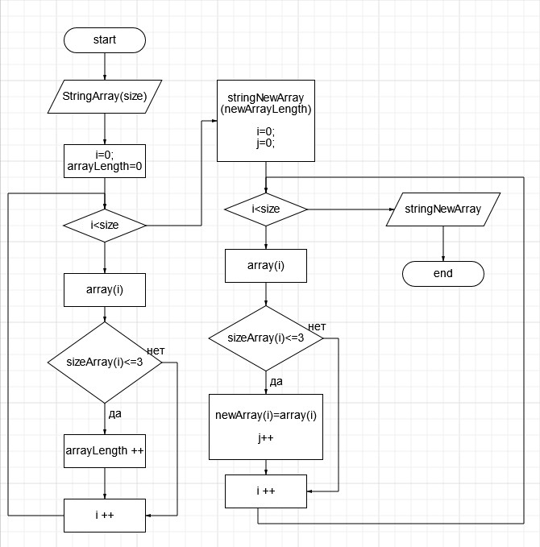

# __Итоговая проверочная работа__

## __Условие задачи:__

*Написать программу, которая из имеющегося массива строк формирует массив из строк, длина которых меньше либо равна 3 символа.*

### __Блок-схема решения задачи:__

#### __Решение задачи:__

*1. "CreateStringArray1" - объявляется массив строки с длинной по решению пользователя. Объявленный массив заполняется элементами массива в указанном количестве.*

*2. "CreateStringArray2" - определяем размер строки массива, символы которой меньше или равно трем.*

*3. "PrintStringArray" - оформление полученного в результате решения массива и вывод его значений.*
